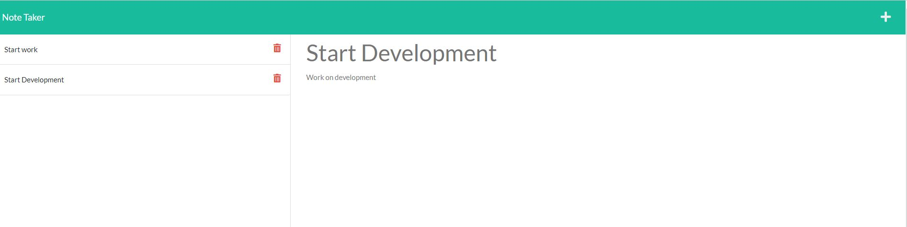

# note-taker

## Table of Contents:

- [Git-Repository](#git-repository)
- [Deployed-Application](#deployed-application)
- [Demo-Video](#walktrough-video)
- [Description](#description)
- [Pseudo-code-Description](#pseudo-code-description)
- [Build-Process](#build-process)
- [Installation](#installation)
- [Usage](#usage)
- [Tests](#tests)
- [License](#license)
- [Contributing](#contributing)
- [Questions](#questions)
- [Screenshots](#screenshots)

## Git Repository

I created a git repository folder that will host the finished project.
The Repository will be found [here](https://github.com/pfansi/note-taker)

## Deployed Application

The deployed application to Heroku will be found [here](https://pfansi-note-taker-express.herokuapp.com/notes)

## Link to the walktrough video

Application video [demo](https://watch.screencastify.com/v/wL4R3eTraFFwlwbNR8pA)

## Description:

This project required to build a Node.js application that will allow users to write and save notes.Users will also be able to retrieve previous notes saved.
The application will be using an Express.js module at the back end.
The finished application will then be deployed on Heroku.

## pseudo code description

- the application will be accessed from a link at the front landing page.
- the note page will show previously saved notes.
- when clicking on previously saved notes featured we will be able to see the full content .
- the note page will allow the user to enter the note title and description
- a save button from the note page will allow the user to save the current note.

## Build process

- create a readme file and describe the application .
- created the file index.js and the functions that will render note.html and index.html
- created the functions in index.js in utils folder that will render , read and write into files.
- Index.js for the router created
- HTML and API router created and used in index.js
- created server.js file and commented codes.
- application connected and deployed to Heroku via Github page

## Installation:

---

Run this command to install dependencies:

  <pre><code>
  npm install
  </code></pre>

## Usage:

---

Run this command to start the app:

  <pre><code>
  npm start
  </code></pre>

## Tests:

Run this command to run the test

<pre><code>
  npm run test:watch
  </code></pre>

## License:

[License: MIT](https://opensource.org/licenses/MIT)

# This Project is licensed under the MIT license

## Contributing:

Project is opened for contributions.

## Questions:

- **Contact details:**
  - Github: [@pfansi](https://github.com/pfansi)
  - Email: pfansi76@gmail.com

## Screenshots

- Screenshot of the finished application
  
